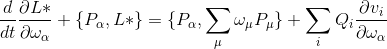
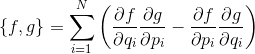
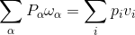
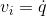
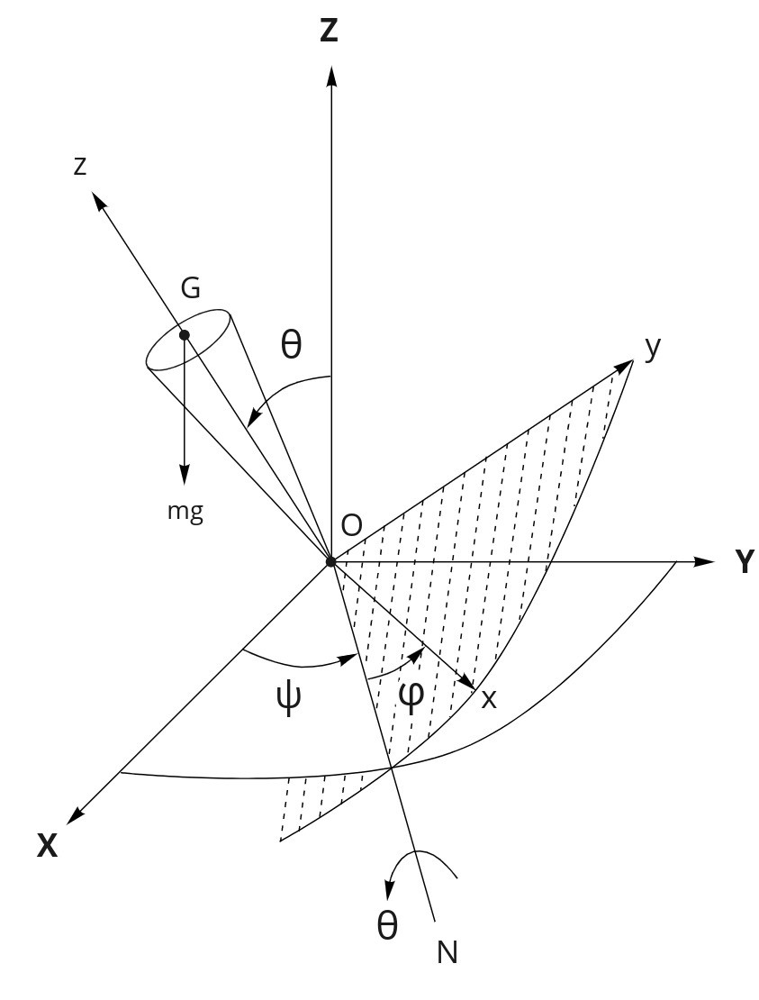

## Уравнения Татаринова для треугольной платформы на рояльных колесах

### Описание 

Данная библиотека позволяет получать уравнения в локоничных формах им Я. В. Татаринова ([Книга](http://bookre.org/reader?file=470257),  [Описание уравнение - Зобова А. А.](http://elibrary.udsu.ru/xmlui/bitstream/handle/123456789/9494/Zobova.pdf)).

#### Уравнениния:


 
где:
 
 -  
 -  
 -   
 

### Тестирование

Уравнения протестированы на 3 задачах. Одноименные юпитер-ноутбуки для данных задача лежат в папке `notebooks`. 

 1. Тело под действием внешней силы
 
 2. Волчок Лагранжа
 
 3. Треугольная платформа на рояльных колсеах
 

### Установка

Склонировать репозиторий:
```shell script
git clone https://github.com/git-alice/tatarinov_equation.git
```

Установить зависимости
```shell script
pip install -r requirements.txt
```

Установить локально в режиме editable:
```shell script
pip install -e .
```

### Web

Кроме всего прочего в папке `web` лежит код сервера, использующий [flask](https://github.com/pallets/flask) и [latex.js](https://github.com/michael-brade/LaTeX.js), который выгружает все сериализованные уравнения и показывает в виде небольшого сйта. Это может быть удобно, как оказалось, далеко не всегда, но выглдяит неплохо.

Для запуска:

```shell script
python bin/run_web.py
```


###  TODO:
Так как в пакете `sympy` есть встроенный модуль [mechanics](https://docs.sympy.org/latest/modules/physics/mechanics/index.html), о котором я поздно узнал, то классы и логику в какой-то степени можно переписать используя данные возможности.
 